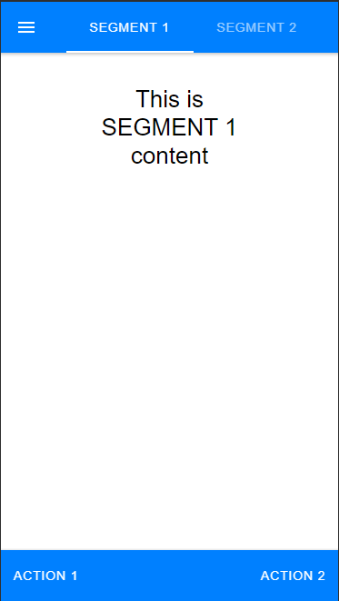
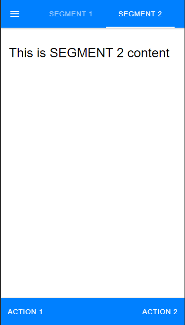

# sample_segment

How to use Segment container component


For more technical informations : [documentation](./project.md)

- [Installation](#installation)
- [Mobile Application](#mobile-application)
    - [Pages](#pages)
        - [Page](#page)


## Installation

1. In your Convertigo Studio click on  to import a project in the treeview
2. In the import wizard

   
   
   paste the text below into the `Project remote URL` field:
   <table>
     <tr><td>Usage</td><td>Click the copy button at the end of the line</td></tr>
     <tr><td>To contribute</td><td>

     ```
     sample_segment=https://github.com/convertigo/c8oprj-sample-segment.git:branch=master
     ```
     </td></tr>
     <tr><td>To simply use</td><td>

     ```
     sample_segment=https://github.com/convertigo/c8oprj-sample-segment/archive/master.zip
     ```
     </td></tr>
    </table>
3. Click the `Finish` button. This will automatically import the __sample_segment__ project


## Mobile Application

Segment container and segment buttons usage

### Pages

#### Page

<ul>
<li>In the <b>pageDidEnter</b> event, a local variable '<b>option</b>' is set with value 1.</li>
<li>In the page Header, a <b>Segment container</b> bound to the local variable 'option' is added.</li>
<li>2 <b>Segment buttons</b> are added with <b>value</b> property set respectively to 1 and 2.</li>
<li>In the page Content, a <b>Switch Directive</b> is set with 2 <b>SwitchCase</b> whose <b>Directive expression</b> properties are set respectively to 1 and 2 (same as Segment buttons)</li>
<li>All the different page content is added to the different SwitchCase</li>
<li>By clicking the Segment buttons, it will switch between the different SwitchCase components.</li>
</ul>
<table>
<tr>
<td></td>
<td></td>s
</tr>
</table>


